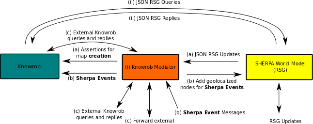

#RSG - Knowrob bridge design

## Overview



The Knowrob component is connected to the SHERPA World Model (SWM) with (i) a **bridge** to 
transform primitives according to the Robot Scene Graph (RSG) data model into assertions that are
added to the knowledgebase of Knowrob and 
(ii) a **query** channel that allows to retrieve information about the world at any given point in time.

### Knowrob Bridge

The bridge component is a central element that serves two purposes: (i) it translates RSG Updates into assertions 
and (ii) it handles incoming **events** that are relevant for a SHERPA mission.

The RSG Updates are send from the SWM to the bridges whenever the world model is changed. 
This is e.g. the case when a new object is created, a pose has been updated or an attribute has been altered. 
In turn an according update, encoded as JSON message, is broadcasted via a ROS message to the bridge. The bridges utilizes
an [Observer](../src//RsgToKnowrobObserver.cpp) Software Pattern to trigger the creation of a new assertion for Prolog as used by Knowrob. 
The [JSON Prolog](https://github.com/knowrob/knowrob/tree/master/json_prolog) interface transmits the assertions. 
An extension of the ontology for RSG specific enteies for the knowledgebase comprises TODO. 
The related Prolog and OWL files can be found in the [knowrob_rsg](https://github.com/bbrieber/knowrob_rsg) 
repository.
The primary use case is the **creation** of the semantic map at start up. In particular it is populated with data originating
from Open Street Map (OSM) which is loaded by the SWM by the [``osmloder``](https://github.com/blumenthal/brics_3d_function_blocks/tree/master/osmloader) 
module. 

The second responsibility of the bridge is to handle incoming [**Sherpa Events**](https://github.com/blumenthal/sherpa_world_model_knowrob_bridge_msgs/blob/master/msg/SherpaEvent.msg).
 I.e. the detection of a human, the insertion of a geo-localized image as requested by a "perception on demand" task, or a task/TST related event.
The effect of such an event is always the same: a new object for the RSG and a new assertion for Knowrob is created with:
* the geopose **where** the event has happened,
* the time stamp **when** it has happened,
* a categorization on **what** has happened and 
* further attributes (key-value tags) describing the details of the event.
The set of agreed attributes is summarized in a [code book](codebook.md). 
Please note, the bride provides the events to Knowrob and SWN at the same time to foster
testability. Knowrob can be tested without the SWM and vice versa. 

### Queries from Knowrob to SWM

In order to obtain information from the SWM, Knowrob can issues queries. These queries are send on demand and are used to gain access to information that has not been explicitly modeled in knowrob. It uses 
the [JSON RSG Query API](https://github.com/blumenthal/ubx_robotscenegraph/tree/master/examples/json_api). 
A typical querie requests pose infomation of an object at a give point in time. Here the SWM serves as an episodic 
memory to improve the reasoning capabilities of Knowrob.
The technical realization uses the Java to Prolog capabilities in Knowrob to issua a **JSON Query** via a ZMQ communication channel to the SWM.
An according response immediatly follows by returning a **JSON RSG Reply** . Note, that only queries can be posed on objects
that have been added as assertion by the bridge beforehands. 

### External queries

The knowrob bridge also allows querieng the database from external applications/agents. These queries are forward as JSON encoded strings through the mediator. This is realized by mapping the JSON-Prolog communication mechanisms to client/server nodes that are used to forward the corresponding service calls. 

## Launching the system

### Sherpa World Model
```
  cd <path_to_ubx_robotscenegraph>
  ./run_sherpa_world_model.sh
  start_all()
```

### Knowrob with bridge
```
  roslaunch sherpa_world_model_knowrob_bridge sherpa_world_model_knowrob_bridge.launch 
```


---

## Modules

### Knowrob

* Same as described [here](https://github.com/bbrieber/knowrob_rsg)
* has *semantic map* with triples	
  * Object
  * Transform
  * Perception Event 
 
### Knowrob Bridge

* Module can be found in **this** repository
* Used *Observer* Software Pattern to send triples to semantic map whenever a RSG update arrives (JSON).
  * Has a configurable *filter* policy
* Recieves Perception Events and 
  * Inserts a Perception Event into semantic map
  * Inserts a geoloclized Node to represent the Prerception Event.  

* TODO
  * [x] Add Perception Event ROS message description a.k.a. **Sherpa Event**
  * [ ] Add semantic map updates within observer 
  * [ ] Add filter
  * [ ] Add handling of Perception Event Messages
  * [x] Add code book for semantic tags

### SHERPA World model

* Same as described [here](https://github.com/blumenthal/ubx_robotscenegraph) 
* Loads OSM map
